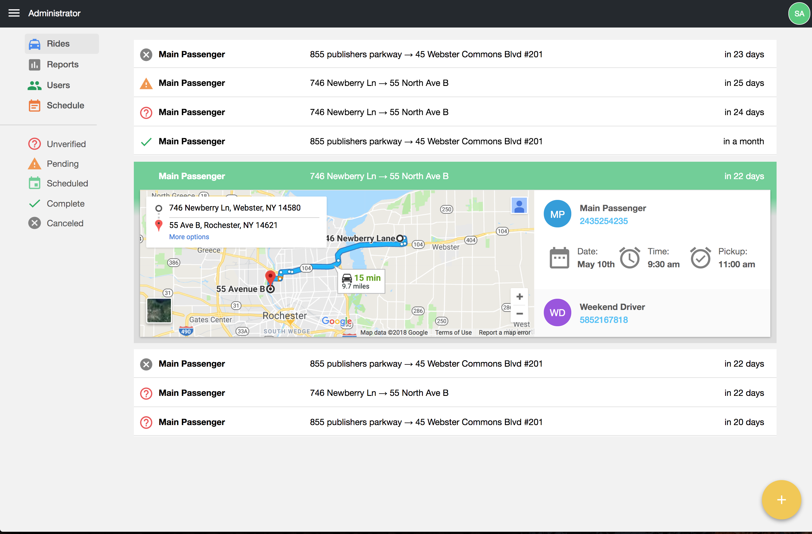

# WASPS-Scheduling-System

[](https://travis-ci.org/mxs4321/WASPS-Scheduling-System)



## [Server](server/README.md)

The server-side requires PHP and a MySQL Database to be set up before it can be run. Update the information in `/server/env.php` to reflect your database's login. To install PHP dependencies, you must have [Composer](https://getcomposer.org/) on your computer.

### Running the Server

To start the server, you must change into the directory with `cd server`. Run `composer install` to install the dependencies and then start the server using `composer start`.

```shell
cd server
composer install
composer start
```

### Running the Test

To Run the API test on the server side, you must change into the directory with `cd server`. If dependencies are not installed run `composer install` to install them and then you can run the test using `composer test`.

```shell
cd server
composer install
composer test
```

## [Client](client/README.md)

The Client side is a React Web application. The client-side requires [Node.js](https://nodejs.org/en/) to be installed before it can be run. To Run the client side, you must change into the directory with `cd client`. If dependencies are not installed run `npm install` to install them and then you can run the test using `npm start`.

```bash
cd client
npm install
npm start
```

### Storybooks

Component Documentation is available using React [storybooks](https://github.com/storybooks/storybook). To Run the storybooks, you must change into the directory with `cd client`. If dependencies are not installed run `npm install` to install them and then you can run the test using `npm run storybook`.

```bash
cd client
npm install
npm run storybook
```

## [Website](http://mxs4321.github.io/WASPS-Scheduling-System)

The website is just plain HTML and CSS. It does not have any dependencies to run. Just open index.html in a web browser. 